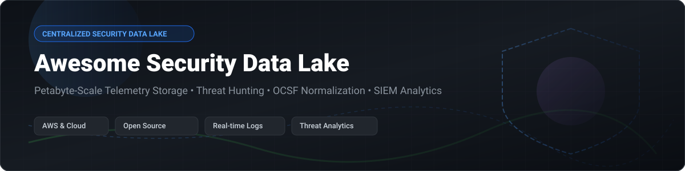

# Awesome-Centralized-Security-Data-Lake

# Awesome-Centralized-Security-Data-Lake 🛡️ 📊

  

  

  

  

  

  

  

---

## 🌟 Top Centralized Security Data Lake Ecosystem

**Curated List of Commercial Security Data Platforms & Open-Source Telemetry Pipelines**  

*Focused on Petabyte-Scale Log Storage, Threat Hunting, Detection Engineering, OCSF Normalization & Self-Hosted Security Analytics*

**Last updated: October 2026** 📅

---

### 📌 Overview & SEO Summary

Welcome to the ultimate curated directory of **centralized security data lake platforms**, **open-source telemetry pipelines**, and **petabyte-scale threat hunting engines**. Whether you are looking for enterprise-grade commercial solutions (such as *AWS Security Lake*, *Google Chronicle*, *Splunk*, and *Microsoft Sentinel*), or self-hostable open-source alternatives (like *Matano*, *Tenzir*, and *Wazuh*), this list covers category leaders, OCSF normalization, and privacy-respecting security analytics.

---

## 📑 Table of Contents

- [🏢 SaaS & Commercial Platforms](#-saas--commercial-platforms)

- [🔓 Open-Source GitHub Projects](#-open-source-github-projects)

- [🛠️ How to Contribute](#%EF%B8%8F-how-to-contribute)

- [📊 Star History](#-star-history)

- [🤝 Support & Sponsorship](#-support--sponsorship)

- [⚠️ Disclaimer](#%EF%B8%8F-disclaimer)

---

## 🏢 SaaS / Commercial Platforms

The security data lake market has bifurcated between cloud-native platforms that separate storage from compute and traditional SIEMs that charge per ingestion volume. IDC MarketScape 2026 recognizes **CrowdStrike, Google, and Rapid7** as Leaders, with **OpenText** in the Contenders quadrant . Pricing models vary dramatically: **AWS Security Lake** charges **$0.75/GB for CloudTrail** and **$0.25/GB for VPC Flow Logs**, with OCSF normalization at **$0.035/GB** . **Microsoft Sentinel** charges **$4.30/GB** PAYG with commitment tiers offering up to **31% discounts** at 100 GB/day (~$108,040/year) . **Google Chronicle** does not publish package rates, but a Forrester study for an $8B enterprise modeled **$500,000/year baseline** (adjusted to $575,000) . **Panther** requires custom quotes with base licenses around **$50K–$95K** plus per-source ingestion .

| SaaS / Commercial Platform | Company / Owner | Valuation / Market Cap | Standard Edition Starting Price | Free Tier / Free Trial Limits | Description |

| :--- | :--- | :--- | :--- | :--- | :--- |

| **[AWS Security Lake](https://aws.amazon.com/security-lake/)** ☁️ | Amazon | ~$2.0 Trillion | **$0.75/GB CloudTrail**; **$0.25/GB VPC Flow/Route53**; OCSF normalization **$0.035/GB**  | **15-day free trial**; then automatic charges apply  | **AWS-native security data lake** — Automatically normalizes AWS logs to OCSF Parquet. Centralizes CloudTrail, VPC Flow, Route 53, Security Hub, and custom sources. Deployed per Region; rollup adds replication transfer. |

| **[Google Chronicle](https://cloud.google.com/chronicle)** 🔷 | Google (Alphabet) | ~$2.0 Trillion | **Quote-based**; Forrester model: $500K–$575K/year for 20K employees  | **Freemium · Self-serve signup**  | **Petabyte-scale SIEM** — Sub-second search across massive telemetry. 12 months hot retention included. **Data Benefit Program** exempts Google Cloud audit logs and Workspace logs (up to 10 GB/day) for Enterprise/Enterprise Plus contracts signed after Feb 1, 2026 . |

| **[Microsoft Sentinel](https://azure.microsoft.com/en-us/products/microsoft-sentinel/)** 🔵 | Microsoft | ~$3.90 Trillion | **$4.30/GB** PAYG (East US); commitment tiers up to **31% discount** at 100 GB/day (~$108K/year)  | **Free trial: 10 GB/day for 31 days** (max 20 workspaces/tenant)  | **Azure-native SIEM** — KQL query language. **Sentinel Data Lake** for cost-effective 12-month retention. **Migrating to Defender portal by March 31, 2027** . |

| **[Splunk Enterprise Security](https://www.splunk.com/)** 🟠 | Cisco (Splunk) | ~$200 Billion (Cisco) | **~$300K–$600K first year for 100 GB/day**  | No free tier; trial available | **SPL-based SIEM** — 2,600+ Splunkbase apps. **Cisco acquired Splunk March 2024 for $28B** . Requires dedicated Splunk administrators. Enterprise Security and SOAR are additional licenses . |

| **[Databricks Lakewatch](https://www.databricks.com/)** 📊 | Databricks | ~$43 Billion | **Compute-based** (not ingestion-based); up to **80% TCO reduction** claimed  | Preview available | **Agentic SIEM on lakehouse** — Charges for compute, not data ingested/stored. Unity Catalog, Lakeflow Connect, OCSF standardization. **Acquired Antimatter and SiftD.ai** for security domain depth . |

| **[Panther Labs](https://panther.com/)** 🐾 | Panther Labs | Private | **Base ~$50K–$95K/year** + per-source $200–$1,200/source/year  | No free tier; demo available | **Detections-as-code SIEM** — Python files in Git repos deployed via CI/CD. **50 GB/day mid-market: $110K–$170K/year all-in** . Best for engineering-led SOCs. |

| **[Elastic Security](https://www.elastic.co/)** 🔍 | Elastic N.V. | ~$10 Billion | **Serverless: $0.09/GB ingest + $0.017/GB retained/month** (Essentials); **$0.11 + $0.019** (Complete)  | **Free 14-day trial**; no per-endpoint fees since March 2026  | **OpenTelemetry-native SIEM** — Data lake storage efficiency with Elasticsearch search. EASE (AI SOC Engine) layers AI into existing stack. |

| **[Sumo Logic Cloud SIEM](https://www.sumologic.com/)** 📈 | Sumo Logic | Private | **Flex: $0 ingest**, pay per TB scanned ($3.14/TB estimated)  | **Free trial: full access to self-service plans**  | **Credit-based SIEM** — No ingest charges in Flex model; pay for analytics. No overage penalties on usage spikes . |

| **[Devo](https://www.devo.com/)** 📉 | Devo | Private | **Annual cost based on daily ingestion**; unlimited queries, 400 days hot data, unlimited users, 24/7 support included  | No free tier; demo available | **All-inclusive SIEM** — One license metric (data volume) includes multitenancy, unlimited queries, 400 days hot retention, and cloud costs . |

| **[Snowflake Cybersecurity](https://www.snowflake.com/)** ❄️ | Snowflake | ~$50 Billion | **Credit-based**; Security Essentials scanners run free on fixed schedule  | **Security Essentials baseline free**; on-demand runs incur serverless compute costs  | **Data cloud for security analytics** — Leverage Snowflake's data warehouse for security telemetry. Security Essentials provides baseline monitoring at no cost. |

---

## 🔓 Open-Source GitHub Projects

*Sorted by GitHub_Stars_Count (Descending)* 🌟

- **[Matano](https://github.com/matanolabs/matano)**   

  **Open source security data lake for threat hunting, detection & response**, Apache-2.0 licensed. **Petabyte-scale on AWS** — Serverless architecture ingests and analyzes telemetry without infrastructure management . **OCSF-native** — normalizes logs to Open Cybersecurity Schema Framework. Bring your own S3 bucket; compute via Lambda. **The most complete open-source security data lake implementation** . 🏞️

- **[Wazuh](https://github.com/wazuh/wazuh)**   

  **Open-source security platform unifying XDR and SIEM**, GPL-2.0 licensed. **~10k+ stars**. Host-based intrusion detection, file integrity monitoring, vulnerability detection, and log analysis. **Agent-based and agentless** collection. **Zero license cost vs Splunk's $300K–$600K first-year cost** for 100 GB/day . Scales from single host to enterprise. 🛡️

- **[Tenzir](https://github.com/tenzir/tenzir)**   

  **Data pipeline engine for security teams**, BSD-3-Clause licensed. **C++ based** for high-volume event telemetry. **Native support for PCAP and network telemetry formats** — essential for comprehensive security data lakes that include network forensics alongside log telemetry . Security-native pipeline with built-in format support. 🔬

- **[Vector](https://github.com/vectordotdev/vector)**   

  **High-performance observability pipeline**, MPL-2.0 licensed. **Rust-based throughput** handles high data volumes required for full-fidelity data lake ingestion . Routes data to S3, Azure Blob, GCS, and other data lake destinations. **Built by Datadog**. ⚡

- **[Fluentd](https://github.com/fluent/fluentd)**   

  **Open-source unified data collector and log aggregator**, Apache-2.0 licensed. **CNCF ecosystem** member. Plugins for all major object storage and data lake destinations: **S3, GCS, Azure Blob, and HDFS** enable reliable data lake ingestion at scale . 🌊

- **[OpenSOC](https://github.com/OpenSOC/opensoc)**   

  **Centralized security monitoring platform**, Apache-2.0 licensed. **Apache Hadoop-based** — scalable big data approach to security analytics . **Scalable binary data extraction and malware processing** in Hadoop. **The original open-source security data lake architecture** . 🏛️

- **[Apache Metron](https://github.com/apache/metron)**   

  **Real-time big data security analytics**, Apache-2.0 licensed. **Hadoop-native** — ingests, normalizes, and enriches security telemetry at scale. **OpenSOC's successor** at the Apache Software Foundation. 🐘

- **[ElastAlert](https://github.com/Yelp/elastalert)**   

  **Alerting on anomalies, spikes, or other patterns of interest in Elasticsearch**, Apache-2.0 licensed. **Yelp's open-source detection engine** — queries Elasticsearch at regular intervals and triggers alerts on rule matches. **Lightweight alternative to full SIEM** for teams already using Elastic Stack. 🔔

- **[Security Onion](https://github.com/Security-Onion-Solutions/securityonion)**   

  **Linux distro for threat hunting, enterprise security monitoring, and log management**, Apache-2.0 licensed. **Bundles Elasticsearch, Logstash, Kibana, Suricata, Zeek, and Wazuh**. **Complete self-hosted security data lake in a single ISO** . 🧅

- **[HELK](https://github.com/Cyb3rWard0g/HELK)**   

  **Hunting ELK stack**, Apache-2.0 licensed. **Threat hunting platform** built on Elasticsearch, Logstash, and Kibana. **Pre-configured for security analytics** — Jupyter notebooks, Kafka, Spark, and Graph for advanced hunting. 🎯

- **[OpenSearch Security Analytics](https://github.com/opensearch-project/security-analytics)**   

  **Security analytics plugin for OpenSearch**, Apache-2.0 licensed. **AWS-backed open-source SIEM** — detection rules, findings, and alerting built into OpenSearch Dashboards. **The open-source successor to OpenDistro for Elasticsearch Security** . 🔍

---

## 🛠️ How to Contribute

Contributions are welcome! Follow these steps to submit new security data lake platforms or open-source telemetry software:

1. 🍴 **Fork** the repository.

2. 📝 **Add/edit** entries in `README.md` maintaining table/list structure and formatting.

3. 🔗 Include project title, official website/GitHub link, exact Stars_Count, license, and brief description.

4. 🚀 Submit a **Pull Request** with a descriptive summary of your changes.

---

## 📊 Star History

---

## 🤝 Support & Sponsorship

If you find this centralized security data lake repository useful, please consider supporting the project:

- ⭐ **Star** this repository to increase visibility!

- 🔀 **Fork** and share with fellow security engineers, SOC analysts, and open-source advocates.

- ☕ **Sponsor & Buy Me a Coffee**: Support ongoing open-source curation via the [GitHub Sponsor Dashboard](https://github.com/sponsors/ishandutta2007).

---

## ⚠️ Disclaimer

- This is a **community-curated** list — not exhaustive and not an endorsement. ℹ️

- **AWS Security Lake** charges are **per Region** — rollup to a central Region adds replication transfer costs. Adjacent services (Glue crawlers, Lambda transforms, Athena queries, S3 storage) are billed separately .

- **Google Chronicle** pricing is quote-based; package rates are not published. The Data Benefit Program exemption requires **Enterprise or Enterprise Plus tier** and contracts signed after February 1, 2026 .

- **Microsoft Sentinel** migrates to Defender portal by **March 31, 2027** — all Azure portal access will be redirected .

- **Splunk** first-year costs for 100 GB/day typically reach **$300K–$600K** including Enterprise Security and SOAR licenses .

- Open-source security data lakes (Matano, Wazuh, Tenzir) provide self-hosted ownership and transparency, but enterprise-grade SLA guarantees, managed infrastructure, and 24/7 support remain primarily commercial offerings. **Security data lakes contain sensitive telemetry** — review data residency and access controls before deployment. 🛡️

---

  <b>Made with ❤️ for security engineers, SOC analysts, and open-source security data advocates.</b>

